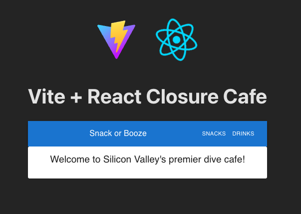
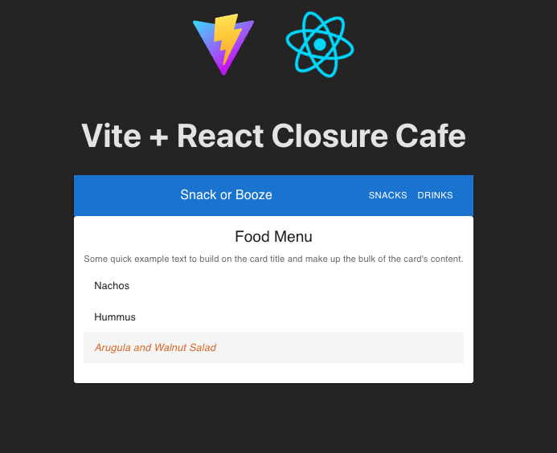
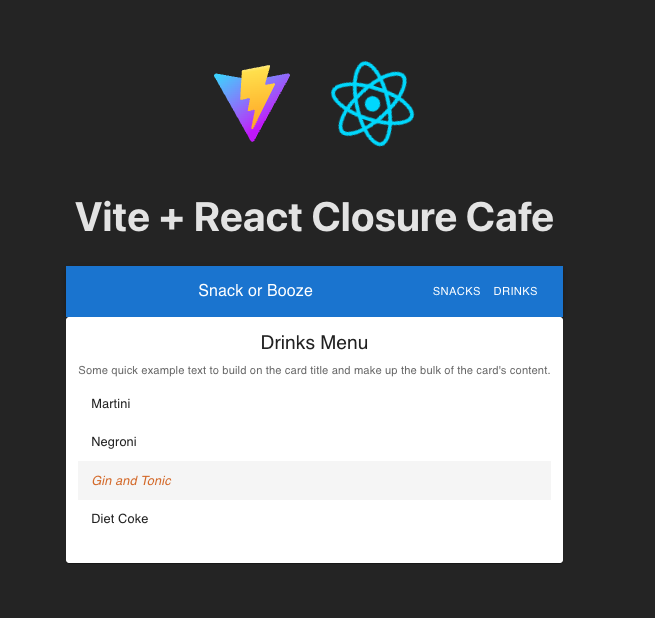
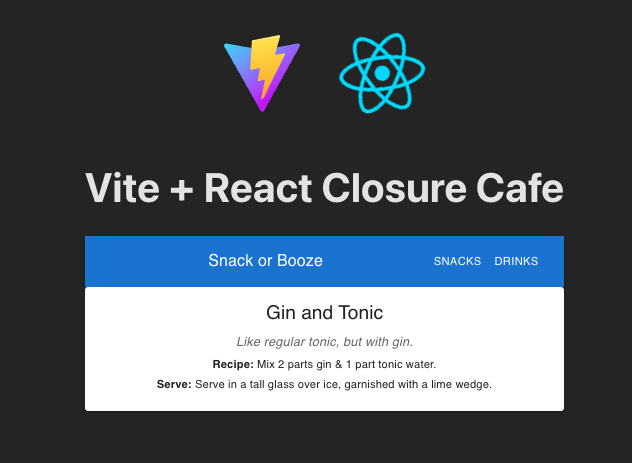

# Vite + React Snack Or 'Drink' App
Three Part project: 1. Respond to prompts about React Router, 2. Write an unroll function, 3. Build a Snack or 'Drink' App using React and React Router.

## Table of Contents
- [Overview](#overview)
- [Screenshots](#screenshots)
- [Project Structure](#project-structure)
- [Technologies Used](#technologies-used)
- [Setup Instructions](#setup-instructions)
- [Future Improvements](#future-improvements)
- [Author](#author)
- [Acknowledgments](#acknowledgments)
- [License](#license)

## Overview
This project consists of three parts. The first part is a conceptual exercise where I answer questions related to React Router and React concepts. The second part involves writing an `unroll` function that processes nested arrays. The third part is building a Snack or 'Drink' application using React and React Router. The application allows users to view a list of snacks and drinks, and see detailed information about each item. The app is styled using Material-UI components.

## Screenshots

## Project Structure
- `src/`
  - `components/` - Contains React components such as `Menu`, `MenuItem`, and `Home`.
  - `App.jsx` - Main application component that sets up routing.
  - `main.jsx` - Entry point of the React application.
  - `helpers/` - Contains utility class with functions in the API.js file for fetching data from JSON-Server.
- `data/` - Contains JSON files for snacks and drinks data.
- `public/` - Contains static assets.
- `README.md` - Project documentation.  

## Technologies Used
- React
- React Router
- Material-UI
- Vite

## Setup Instructions
1. Clone the repository to your local machine.
2. Navigate to the project directory.
3. Install the necessary dependencies using npm
4. Start the development server with npm
5. Open your web browser and go to `http://localhost:5173` to view the application.

## Future Improvements
- Implement search functionality to filter snacks and drinks.
- Improve the UI/UX design for better user experience.

## Author
- Github - [TechEdDan2](https://github.com/TechEdDan2)
- Frontend Mentor - [@TechEdDan2](https://www.frontendmentor.io/profile/TechEdDan2)

## Acknowledgments
The YouTubers and other educational resources I have been learning from include: Coder Coder (Jessica Chan), BringYourOwnLaptop (Daniel Walter Scott), Kevin Powell, Pedro Tech (Vitest tutorial), The Net Ninja (Shaun Pelling) vairous Udemy courses, Geeks for Geeks, Stack Overflow, MDN Web Docs (Animations), and Stony Brook University's Software Engineering Bootcamp (curriculum developed by Colt Steele). 

## License
This project is licensed under the ISC license